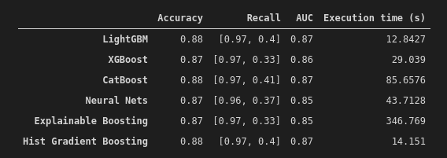

# Election corruption in Africa

This project is my Capstone project of the IBM's advanced Data Science specialization on Coursera.

The project was about the prediction of election corruption in Africa using Machine Learning and Deep Learning.

The data used is the [round 5](https://afrobarometer.org/fr/donn%C3%A9es/donn%C3%A9es-fusionn%C3%A9es) of AfroBarometer survey availabel. Five machine learning models are implemented and compared: lightGBM, XGBoost, CatBoost, Hist Gradient Boosting (from scikit-learn) and Explainable Boosting (interpret ML of microsoft). The comparaison metrics are the accuracy, recall, area under the curve scores and the execution time.

## Summary results

